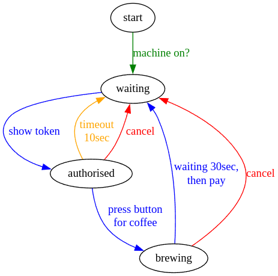

# Kaffeemaschinensteuerung & Abrechnung

Ein kleines ESP32 Skript, um eine jura Impressa S7 zu steuern.

## Features 
### Fair 
Du möchtest eine Faire Kaffeemaschine für dich und deine Kollegen? Kein Problem! Mit diesem Programm und etwas Hardware zahlt jeder Kollege nur noch für den Kaffee, den er auch verbraucht.

### Keine Hardwaremods nötig
Es ist immer ein relativ hohes Risiko, wenn man gerade eine neue Kaffeemaschine gekauft hat und ein solches System dort fest verbaut. Dadurch verliert man in der Regel Garantie und jegliche Ansprüche gegenüber dem Hersteller.
Hier nicht. Hier wird einfach der vorhandene Service Port genutzt, um einen Kaffee auszugeben.

### Abrechnung 
In den meisten Firmen besitzt bereits für Zeiterfassung oder den Zugang zu den Gebäuden jeder Mitarbeiter ein Chip. Dieser wird einfach für dieses System genutzt. 
Wenn Zahltag gekommen ist, kann man einfach nachschauen, wer der Besitzer von welchem Chip ist.

### Datenschutz 
Diese Erweiterung hat absolut keine Internetkommunikation.
Jegliche Verarbeitung wird Anonym und Lokal durchgeführt. Für die Abrechnung wird ein zusätzliches W-Lan Netzwerk geöffnet, welches einen lokalen Webserver anbietet. Dieser ist durch den Access Point Passwort geschützt. 

## Credits 
Vielen Dank an [psct](https://github.com/psct) für das [sharespresso](https://github.com/psct/sharespresso) Projekt. Desweiteren ein großes Dankeschön an [vshymanskyy](https://github.com/vshymanskyy/) für die Bibliothek [Preferences](https://github.com/vshymanskyy/Preferences), ohne die das Speichermanagement sehr aufwändig geworden wäre. Desweiteren vielen Dank an [miguelbalboa](https://github.com/miguelbalboa/) für die Bibliothek [MFRC522](https://github.com/miguelbalboa/rfid/).

**Wenn du dir weitere Funktionen wünscht oder einen Fehler findest, öffne einfach ein Issue hier im [GitHub Repository](https://github.com/Cam42_exe/BOGY_Kaffeemaschine/issues).**

